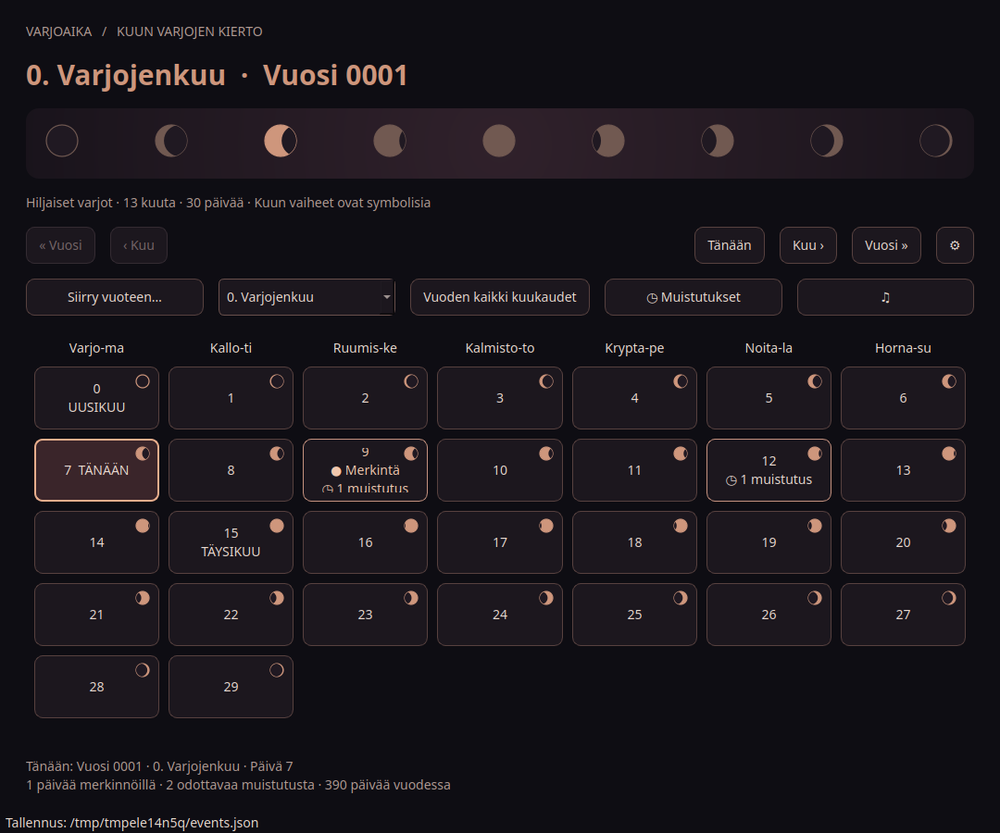
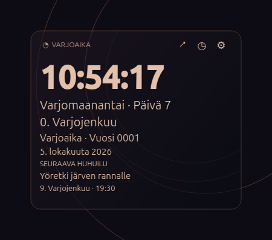

# Varjoaika

The fictional calendar system and application are named **Varjoaika** (Shadow Time).
Formerly Goottikalenteri. The existing GitHub repository and internal data/settings
identifiers are retained so notes and appearance settings survive the rename.

Modular Python / PyQt6 desktop application intended for Ubuntu 26.04 and 26.10
with GNOME. Finnish interface with the new Shadow Copper / Varjokupari theme: charcoal and violet shadows, subdued copper highlights, symbolic moon phases and a distinct atmosphere for each of the 13 months.

## Packages and installation

Required: Python 3 and PyQt6. Install Ubuntu packages and launch:

```bash
sudo apt update
sudo apt install python3 python3-pyqt6 python3-pyqt6.qtmultimedia libnotify-bin
cd goottikalenteri
python3 main.py
```

Alternatively install `python3-venv`, then:

```bash
python3 -m venv .venv
.venv/bin/python -m pip install -r requirements.txt
.venv/bin/python main.py
```

Qt automatically selects Wayland or X11. The Ubuntu package installation supplies
Qt's system dependencies. Calendar and notes work offline; scheduled clock checks use the public NTP service.

## User launchers

After installing the runtime, create calendar and widget launchers without sudo:

```bash
python3 install.py
# With a virtual environment:
.venv/bin/python install.py --python .venv/bin/python
```

This installs **Varjoaika** and **Varjoaika-widget** into your application menu.
Keep this source folder and the selected Python runtime in place. Existing launcher
files are backed up, and calendar data/settings are preserved. Login startup is
optional in **Ilmoitukset ja ääni**.

## Calendar

Years begin at 0001; each has exactly 13 months (0–12) and 30 days per month (0–29).
One year is 390 days. Days last 24 hours; weeks have seven days, Monday to Sunday.
The user's parallel-calendar anchor is Sunday 4 October 2026 = year 0001,
month 0 (Varjojenkuu), day 6. Therefore day 0 is Monday 28 September 2026.
Weekdays continue across month boundaries. All visible dates and years use only the fictional calendar. Gregorian
dates are used internally to determine today from the computer clock. The app opens on today's fictional date using the computer's local
date; before the epoch it opens at day 0. “Tänään” returns to today.

Day 0 is always a fictional new moon. The full moon at day 15 and intermediate
phase labels are symbolic, not astronomical predictions. There are no leap days.
The calendar also supports timed reminders. Daylight saving does not change its date arithmetic. Local midnight controls the today marker.
There is no application-imposed maximum year. Both timelines continue beyond
year 9999 using integer arithmetic. ‘Siirry vuoteen…’ jumps directly to any positive
year. Practical limits are available memory, display width, and Python's integer
text-conversion limit. The 390-day year naturally drifts relative to Gregorian years,
while both calendars refer to the same passing days.

## Events

Click a day to edit its plain-text note. Enter multiple events on separate lines.
“Tallenna” saves, “Peruuta” cancels, “Poista” deletes after confirmation.
Saving blank text removes the note. Notes persist between restarts.

Default storage uses Qt's XDG application-data location, normally
`~/.local/share/Goottikalenteri/Goottikalenteri/events.json`. The exact path is shown in the status
bar. Override with `python3 main.py --data-file /absolute/path/events.json`.
JSON structure:

```json
{"version": 1, "events": {"0001-02-05": "Example note"}}
```

Writes use a private temporary file and atomic replacement. Failed writes preserve
the previous data and leave the editor open. Malformed JSON or invalid dates stop
startup without overwriting the file; repair or back up that file before restarting.
A file lock prevents simultaneous application instances writing the same file.
Back up events.json as needed; it contains plain text.

## Keyboard and GNOME

Tab moves focus; Space/Enter activates day buttons. Alt+Left/Right changes month,
Alt+Up/Down changes year. Ctrl+Enter saves the editor; Escape cancels.
Scalable native widgets, automatic Qt display scaling, and a scrollable grid support
GNOME displays. The Fusion palette keeps the entire application dark regardless
of the desktop's light/dark preference.

Optional GNOME launcher: copy `goottikalenteri.desktop` to
`~/.local/share/applications/`. Its Exec path points to this project location;
update it if you move the files or use a virtual environment.

## Modules and validation

`main.py`: startup, palette, data location and locking.
`calendar_model.py`: custom dates, lunar labels, parallel dates and weekdays.
`storage.py`: validated JSON and atomic writes.
`ui.py`: calendar grid and note editor.

```bash
python3 -m unittest discover -s tests -v
```

Calendar/storage tests, Python compilation and offscreen PyQt6 GUI tests were run.
The GUI checks verify transparent background pixels, font resizing, preview cancellation,
persistent settings and standalone controls. The widget and settings were rendered
and visually inspected. Actual Ubuntu GNOME/Wayland desktop integration remains
untested; the offscreen checks do not simulate a compositor.

## Varjokupari desktop widget and reminders (0.6.0)




The Ubuntu 26.04-inspired widget complements the weather widget with darker,
shadowy copper colours. It shows the local clock, fictional day/month/year, official
Finnish date and the next reminder. **↗** opens the calendar, **◷** opens reminders,
and **⚙** opens widget settings. Drag the widget to move it, or use its context menu.
Existing font, colour, position and weather preferences are preserved.

```bash
python3 main.py --widget-only
```

Widget settings provide **Varjokupari** or the original transparent-text style,
**0–100% background opacity**, separate text opacity, font sizes, alignment,
position locking and optional always-on-top. Zero background opacity removes the
panel, border and orbits. Appearance changes preview immediately; Cancel restores
previous values. Optional wttr.in weather remains available.

**Muistutukset** opens the agenda. Add, edit or remove reminders there; clicking a
calendar day also provides **Päivän muistutukset** in its note editor. Each reminder
has a fictional date, local time, title, optional description and enabled switch.
Day tiles show the number of pending reminders; any number can share a day.

When due, a reminder opens an action window and, if `notify-send` is installed,
an Ubuntu notification. **Kuittaa** closes it; **Siirrä 10 min** snoozes it. The default
sound is an original synthetic eagle-owl-style double hoot, not a wildlife recording.
**♫ / Ilmoitukset ja ääni** adjusts volume (0–100%), mutes sound or selects a local
WAV, OGG, MP3, FLAC, M4A or Opus file. Codec support depends on the Qt/Ubuntu runtime;
playback errors are shown in the notification or sound-test dialog. The settings
window has **Kokeile** and **Pysäytä** buttons.

Reminders need a running application. Closing the calendar keeps an enabled widget
running; if pending reminders exist, it opens the widget automatically so the process
remains accessible. **Lopeta** exits the application and stops reminders. Enable
**Käynnistä widget ja muistutukset kirjautuessa** in sound settings for login startup.
Suspended computers do not wake for reminders; overdue reminders are delivered once
on waking or restarting the application. Existing delivered reminders stay delivered.

Reminders are stored separately beside the note file, normally
`~/.local/share/Goottikalenteri/Goottikalenteri/events-reminders.json`. The original `events.json`
format and notes remain unchanged. Custom `--data-file` paths receive their own
`<stem>-reminders.json`. Writes are atomic and owner-only. Failed delivery-state writes
leave the reminder pending for retry; malformed files are never overwritten.
The deadline is a UTC instant computed from the machine's local timezone when saved.
Changing timezone later keeps that instant; edit the reminder to use a new local time.
Nonexistent DST spring times are rejected; ambiguous autumn times use the system's
first occurrence chosen at saving. Scheduled reminders support civil years up to 9999;
ordinary notes retain the calendar's unbounded-year support.

For system Python, install `python3-pyqt6.qtmultimedia` for sound. A PyQt6 virtual
environment or AppImage includes the module. `libnotify-bin` supplies `notify-send`;
the action window remains available without it.

The transparent clock is a frameless Qt surface. Wayland controls exact placement;
X11/XWayland can restore saved geometry. Both views share the same note-file lock
and running process. Settings and launch-mode identifiers remain Goottikalenteri.

## Full calendar navigation

The month dropdown selects any of the 13 months. “Vuoden kaikki kuukaudet” opens
a year overview with all 13 months and each month's note count; click a month to
open it. “Siirry vuoteen…” changes the year directly without changing the selected
month. Previous/next month navigation crosses year boundaries automatically.
Every day of every year supports its own persistent note. Main window, note dialogs,
year overview and desktop widget display only fictional dates and years.

## License

MIT License. Copyright (c) 2026 Jakke77. See [LICENSE](LICENSE).

## Two AppImage launchers

The GitHub release provides two independent x86_64 downloads, with Python
and PyQt6 included. Choose the calendar or the transparent desktop clock:

```bash
chmod +x Varjoaika-0.4.0-x86_64.AppImage Varjoaika-widget-0.4.0-x86_64.AppImage
./Varjoaika-0.4.0-x86_64.AppImage
./Varjoaika-widget-0.4.0-x86_64.AppImage
```

The calendar package opens only the calendar by default. The widget package opens
only the clock; no command-line switch is needed. Both are self-contained, so you
can download just the one you want. The widget's context menu can still open the
full calendar. Either package also accepts `--calendar` or `--widget-only` to override
its default. Neither enables automatic login startup.

If one package is already running, the other launcher tells that process to display
the calendar or widget. Both views can remain open together while one process owns
the event file. A repeated launch does not create duplicate clocks. Closing the
calendar after launching the widget leaves the clock running; use its right-click
“Lopeta” command to exit everything. Notes and font settings are shared.

Download from https://github.com/Jakke77/goottikalenteri/releases (requires access).
If FUSE mounting is unavailable, add `--appimage-extract-and-run` before the app
arguments. Notes and settings remain outside the read-only AppImage.

Target: x86_64 Linux desktops, including Ubuntu 26.04 and 26.10. The release's
`build-info.json` records the required glibc symbol version. Offscreen tests verify
both launch modes, calendar logic, IPC, font settings and background transparency;
actual clean GNOME/Wayland installations remain untested.

Build both packages on Linux x86_64:

```bash
sudo apt install python3-venv binutils squashfs-tools
python3 -m venv .venv
.venv/bin/python -m pip install -r requirements-build.txt
.venv/bin/python packaging/build_appimage.py --version 0.4.0 --variant both
```

Use `--variant calendar` or `--variant widget` to build just one. The script puts a
PyInstaller onedir bundle inside each AppImage, includes original source/license
notices, checks pinned official tooling hashes, and tests the launcher's default mode.
Outputs, source ZIP, `build-info.json` and `SHA256SUMS` go into `release-assets/`,
which is excluded from Git. Each archive includes build instructions and the
GitHub Actions release workflow. Actions builds both images on Ubuntu 24.04 when
a release is published, tests them and uploads the assets to that private release.
The workflow can also be run manually for an existing release tag.

The original code is MIT. Bundled dependencies retain their own licenses, including
PyQt6 GPLv3; see [THIRD_PARTY_NOTICES.md](THIRD_PARTY_NOTICES.md).

### Ajan tarkistus

Sovellus tarkistaa ajan julkiselta `time.mikes.fi`-NTP-palvelimelta jokaisen
goottikuun päivänä 7 klo 07.07.07 tietokoneen paikallista aikaa. Suljettuna
väliin jäänyt tarkistus tehdään seuraavalla käynnistyksellä. Verkkovirheen
jälkeen uusi yritys tehdään tunnin kuluttua. Widgetin oikean painikkeen valikko
näyttää tarkistuksen tilan. UDP-portin 123 on oltava käytettävissä.
Korjaus vaikuttaa vain sovelluksen kelloon ja tämän päivän päivämäärään;
järjestelmäkelloa ei muuteta eikä ylläpitäjän oikeuksia tarvita. NTP-korjaus
on istuntokohtainen; tietokoneen oma ajan synkronointi kannattaa pitää päällä.

## Goottiviikonpäivät

Varjomaanantai, Kallotiistai, Ruumiskeskiviikko, Kalmistotorstai,
Kryptaperjantai, Noitalauantai ja Hornasunnuntai vastaavat tavallista
maanantaista sunnuntaihin jatkuvaa seitsemän päivän viikkoa. Kalenterin
sarakkeet käyttävät lyhyitä nimiä; widget ja päivän muistiinpanoikkuna
näyttävät koko nimen.

## Android home-screen widget

See [android/README.md](android/README.md). Android 6.0+ (API 23) is the minimum
for the native Android widget. The initial APK is debug-signed and labelled a test
build; unit tests, lint and compilation run in GitHub Actions. Physical Android
phones/launchers and every OS version have not been tested. Android uses system
time and may delay date updates in Doze. Linux remains the full calendar edition.

### Sää widgetissä (0.5.0)

Avaa widgetin asetukset ja valitse **Näytä wttr.in-sää (3 päivää)**.
Automaattinen sijainti perustuu sääpalvelun havaitsemaan julkiseen IP-osoitteeseen;
se voi näyttää VPN:n tai operaattorin sijainnin. Poista automaattinen sijainti
ja kirjoita kaupungin tai kylän nimi (tarvittaessa myös maa), jos haluat tarkemman paikkakunnan.
Paikkakunta lähetetään HTTPS-yhteydellä [wttr.in-palveluun](https://github.com/chubin/wttr.in).
Sään käyttö on oletuksena pois päältä.

Kolmella rivillä näkyvät virallinen päivämäärä, alin/ylin lämpötila, keskipäivän
sääkuvaus ja suurin päivän sateen todennäköisyys. Ennuste alkaa tästä päivästä.
Säätekstin koko on säädettävissä erikseen. Haku tehdään taustalla tunnin välein,
ja viimeisin ennuste säilyy paikallisesti yhteyskatkon aikana. Vanhentuneesta
ennusteesta ilmoitetaan; menneitä ennustepäiviä ei näytetä. Linux-widgetin
hiiren oikean painikkeen valikossa on **Päivitä sää nyt**.

Androidissa sää käyttää samaa palvelua ja asetuksia. JobScheduler hakee sään
verkkoyhteyden ollessa käytettävissä; virransäästö voi viivästyttää päivitystä.
Kasvata kotinäytön widgetin korkeutta, jotta kaikki ennusterivit mahtuvat.
APK on edelleen testiversio ja edellisen testiversion allekirjoitus voi poiketa:
asennus voi edellyttää vanhan APK:n poistamista.
